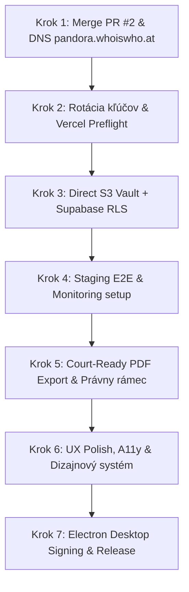

# 📋 PΛND0RΛ Browser & ForenX OS — Kompletný Produkčný Backlog

Tento dokument predstavuje autoritatívny akčný plán (backlog) na dokončenie, zabezpečenie a stabilizáciu celého ekosystému **PΛND0RΛ Browser & ForenX OS** pre ostrú produkčnú prevádzku, súdnu akceptovateľnosť (Court-Readiness) a dlhodobú škálovateľnosť.

---

## 🎯 Prehľad Prioritizačných Úrovní (Prioritization Matrix)

| Priorita | Názov kategórie | Cieľ | Termín / Blokátor |
| :---: | :--- | :--- | :---: |
| **P0** | **Kritická infraštruktúra, bezpečnosť a integrita** | Zabezpečiť systém proti zlyhaniu, úniku dát a narušeniu integrity | Okamžite (Sprint 1) |
| **P1** | **Compliance a forenzná akceptovateľnosť** | Splniť legislatívne požiadavky (Trestný poriadok, GDPR, Chain of Custody) | Sprint 2 |
| **P2** | **Produkt, UX a prístupnosť (a11y)** | Odstrániť trenie pre vyšetrovateľa, konzistentné stavy a dizajnový systém | Sprint 3 |
| **P3** | **Dlhodobá architektúra, Electron & Škálovateľnosť** | Samostatná release pipeline pre Desktop, profiling veľkých dát a hardening | Sprint 4 |

---

## 🚨 P0: Kritická Infraštruktúra, Bezpečnosť a Stabilita (Must-Have)

### `P0-01` Schválenie a merge PR #2 + Nasadenie vlastnej domény
- **Stav:** Otvorené (`gh pr view 2`)
- **Popis:** Dokončiť nasadenie produkčnej domény `pandora.whoiswho.at` s priradeným WebAuthn RP ID na Verceli a VPS reverznom proxy.
- **Akceptačné kritériá (DoD):**
  - [ ] PR #2 nezávisle zrevidovaný a mergnutý do `main`.
  - [ ] DNS záznamy pre `pandora.whoiswho.at` smerujú správne na produkciu.
  - [ ] WebAuthn / Passkeys bezchybne fungujú na novom hostname `pandora.whoiswho.at`.
  - [ ] SSL certifikát overený (Let's Encrypt / Vercel Edge SSL).

### `P0-02` Bezpečnostná rotácia kľúčov a Vercel Preflight audit
- **Popis:** Zabezpečiť, že žiadne tajomstvá neboli kompromitované v histórii git a všetky produkčné premenné prešli prísnym preflightom.
- **Akceptačné kritériá (DoD):**
  - [ ] Vygenerovať a rotovať nové kľúče: `SUPABASE_SERVICE_ROLE_KEY`, `HETZNER_S3_SECRET`, `MISTRAL_API_KEY`, `GEMINI_API_KEY`.
  - [ ] Skontrolovať `scripts/vercel-preflight.mjs` – 0 chýbajúcich premenných.
  - [ ] Overiť, že v git repo nie je commitnutý žiadny reálny `.env` ani citlivý súbor.

### `P0-03` Direct-to-S3 Vault s prísnou autentifikáciou a Supabase RLS
- **Popis:** Odstrániť obmedzenia veľkosti payloadu na Verceli (max 4.5 MB) zavedením direct uploadu do Hetzner S3 cez predpodpísané URL s nezávislou verifikáciou SHA-256 a Row Level Security (RLS) v Supabase.
- **Akceptačné kritériá (DoD):**
  - [ ] Endpoint `/api/vault/presign-upload` vygeneruje presigned PUT URL len pre overenú session vyšetrovateľa.
  - [ ] Klient nahrá súbor priamo do S3 (`multipart/form-data` alebo direct streaming).
  - [ ] Po uložení sa zapíše audit záznam do Supabase `evidence_items` s vynútenou RLS politikou (iba priradený vyšetrovateľ).
  - [ ] Anti-tampering ochrana (CWE-345) overí SHA-256 hash pred finálnym zaevidovaním.

### `P0-04` Monitoring, Telemetria a Výstrahy (Alerting)
- **Popis:** Zaviesť centralizovaný monitoring chýb, latencie a zlyhaní služieb.
- **Akceptačné kritériá (DoD):**
  - [ ] Vercel Analytics / Sentry integrácia pre frontendové aj serverless runtime výnimky.
  - [ ] Alerting na zlyhanie volania AI providerov (Mistral timeouty > 60s, Gemini rate-limity).
  - [ ] Monitorovanie chybovosti S3 uploadov (upload failure rate > 1% = výstraha).
  - [ ] Supabase databázový connection pool & error telemetry.

### `P0-05` Bezpečnostná hlavička a Content Security Policy (CSP) Audit
- **Popis:** Eliminovať XSS a inline skript riziká zavedením striktného CSP.
- **Akceptačné kritériá (DoD):**
  - [ ] `next.config.mjs` obsahuje kompletné CSP pravidlá bez `unsafe-inline` kde je to možné (nonces pre skripty).
  - [ ] `Strict-Transport-Security: max-age=63072000; includeSubDomains; preload` aktívne na všetkých odpovediach.
  - [ ] Zavedený `Content-Security-Policy-Report-Only` na sledovanie nežiaducich blokovaní pred tvrdým zapnutím.

### `P0-06` Zálohovanie a Disaster Recovery (DR) Postup
- **Popis:** Zabezpečenie kontinuity vyšetrovacích spisov v prípade výpadku cloudu.
- **Akceptačné kritériá (DoD):**
  - [ ] Supabase Point-in-Time Recovery (PITR) a denné snapshoty databázy.
  - [ ] Hetzner S3 Object Versioning a Object Lock (WORM – Write Once Read Many pre nemennosť dôkazov).
  - [ ] Zdokumentovaný a manuálne otestovaný restore test: obnovenie spisu zo zálohy do 15 minút.

---

## ⚖️ P1: Compliance, Forenzná Integrita a Súdna Prípustnosť

### `P1-01` Court-Ready Deterministický Export spisu
- **Popis:** Generovanie súdne akceptovateľného balíka (Court-Ready Dossier) v PDF a štandardizovanom JSON-LD.
- **Akceptačné kritériá (DoD):**
  - [ ] Export obsahuje deterministickú verziu softvéru, verziu algoritmu, dátum a presný čas (UTC + lokálny).
  - [ ] Každá príloha a dôkaz obsahuje SHA-256 odtlačok a záznam o reťazci úschovy (Chain of Custody).
  - [ ] Digitálny podpis exportu (kryptografická pečať vyšetrovateľa cez privátny kľúč / WebAuthn).
  - [ ] Vygenerovaný PDF report spĺňa formálne náležitosti znaleckého / vyšetrovacieho posudku.

### `P1-02` Prepojenie Admissibility Audit na Právny rámec (Trestný poriadok SR)
- **Popis:** Prepojiť modul `/forza/pravny-kontext` a `/forza/sandbox` s konkrétnymi paragrafmi zákona.
- **Akceptačné kritériá (DoD):**
  - [ ] Každý typ zaistenia dôkazu odkazuje na príslušný paragraf (§ 89 až § 96 Trestného poriadku – Zaistenie vecí a počítačových údajov).
  - [ ] Automatická kontrola legality: upozornenie vyšetrovateľa, ak dôkaz nemá zaznamenaný príkaz súdu/prokurátora.
  - [ ] Verziovaný súhrn pre súd s vyznačenými prípadnými procesnými rizikami (Remediation Notes).

### `P1-03` Dátová klasifikácia a Retention Policy (Životný cyklus spisov)
- **Popis:** Riadenie uchovávania, archivácie a likvidácie citlivých kriminálnych dát.
- **Akceptačné kritériá (DoD):**
  - [ ] Implementácia stavov spisu: `Rozpracovaný`, `Uzavretý`, `V súdnom konaní (Legal Hold)`, `Archivovaný`, `Skartovaný`.
  - [ ] Funkcia **Legal Hold**: blokovanie akéhokoľvek výmazu alebo modifikácie dát počas trvania súdneho konania.
  - [ ] Schvaľovací workflow: výmaz alebo skartácia dôkazu vyžaduje potvrdenie administrátora + záznam do auditu.

### `P1-04` Ochrana súkromia (GDPR) a Sanitizácia PII v logoch
- **Popis:** Zabezpečenie, že v aplikačných logoch a AI výzvach neunikajú osobné údaje nezaradených osôb.
- **Akceptačné kritériá (DoD):**
  - [ ] Všetky logy z Vercel a VPS automaticky anonymizujú rodné čísla, IBAN-y a heslá.
  - [ ] Režim anonymizácie pre AI Copilota: maskovanie mien a adries pred odoslaním do cloudových modelov (Mistral/Gemini).
  - [ ] Export osobných údajov a audit prístupov k spisu (kto, kedy a z akej IP nahliadol do spisu).

---

## 🎨 P2: Produkt, UX a Dizajnový Systém

### `P2-01` Konzistentný Feedback pre mutačné operácie
- **Popis:** Zjednotiť vizuálnu odozvu pri každej akcii používateľa (nahrávanie, úprava, mazanie, spustenie AI).
- **Akceptačné kritériá (DoD):**
  - [ ] Tlačidlá majú počas akcie spinner a stav `disabled` (zamedzenie double-clicku).
  - [ ] Zjednotené Toast notifikácie (úspech, varovanie, kritická chyba s možnosťou Retry).
  - [ ] Deštruktívne akcie (zmazanie dôkazu, resetovanie spisu) vyžadujú explicitný potvrdzovací dialóg s nutnosťou napísať názov prípadu.

### `P2-02` Prístupnosť (Accessibility - a11y) & Responzivita na 100dvh
- **Popis:** Zabezpečiť bezproblémové ovládanie na mobiloch, tabletoch a desktopoch podľa WCAG 2.1 AA.
- **Akceptačné kritériá (DoD):**
  - [ ] Plná podpora navigácie cez klávesnicu (`Tab`, `Enter`, `Escape` v modaloch a Omniboxe).
  - [ ] Správne nastavené `focus-trap` v dialógoch a ARIA menovky (`aria-expanded`, `aria-label`).
  - [ ] Formát layoutu využíva dynamický viewport `100dvh` na mobiloch (žiadne zakrývanie navigačnou lištou).
  - [ ] Kontrast textov vo Forza dark mode spĺňa minimálny pomer 4.5:1.

### `P2-03` Zjednotenie terminológie naprieč systémom
- **Popis:** Odstrániť zmätok v pojmoch medzi webom a desktopovým rozhraním.
- **Akceptačné kritériá (DoD):**
  - [ ] Všade v UI konzistentne používať pojem **„Prípad“** (alebo **„Vyšetrovací spis“**); odstrániť náhodné použitie „Projekt“.
  - [ ] Zjednotiť anglicko-slovenské názvy tlačidiel vo Forza module na čistú slovenčinu s medzinárodnými skratkami (SHA-256, IBAN, IČO).

### `P2-04` Empty States & Skeletons pre všetky moduly
- **Popis:** Každý modul (Osoby, Vzťahy, Zbrane, Bankové výpisy, Trezor) musí mať zmysluplný prázdny stav.
- **Akceptačné kritériá (DoD):**
  - [ ] Pri načítavaní sa zobrazujú moderné pulzujúce skeletony (žiadny layout shift).
  - [ ] Prázdny stav obsahuje ikonku, vysvetlenie a akčné tlačidlo (napr. *„Zatiaľ žiadne subjekty — Pridať osobu alebo Importovať CSV“*).
  - [ ] Offline stav jasne indikuje, ktoré dáta sú dostupné lokálne v IndexedDB.

---

## 🏗️ P3: Dlhodobá Architektúra, Výkon a Electron Desktop

### `P3-01` Čisté oddelenie Web vrstvy a Electron Desktop Shellu
- **Popis:** Zabezpečiť nezávislú zostaviteľnosť a publikovanie webu (Next.js na Vercel/VPS) a desktopovej aplikácie (Electron).
- **Akceptačné kritériá (DoD):**
  - [ ] Webové zostavenie neobsahuje žiadne priame volania Node.js modulov (`fs`, `child_process`).
  - [ ] Electron komunikuje s Next.js rozhraním výhradne cez zabezpečený `preload.ts` a `contextBridge`.
  - [ ] Vytvorená samostatná build pipeline pre Electron bez zlyhávania na webových závislostiach.

### `P3-02` Profilovanie výkonu a optimalizácia veľkých dát (Big Data Performance)
- **Popis:** Zvládnutie analýzy veľkých bankových výpisov a grafov bez zamrznutia prehliadača.
- **Akceptačné kritériá (DoD):**
  - [ ] Cytoscape / WebGL sieťový graf zvláda 5 000+ uzlov a väzieb pri stabilných 60 FPS.
  - [ ] Import CSV výpisov spracováva dáta po blokoch (Web Workers alebo serverový streaming), aby neblokoval hlavné vlákno.
  - [ ] Virtualizácia zoznamov (TanStack Virtual) pre transakcie s viac ako 10 000 riadkami.

### `P3-03` Zod Contract Validation na všetkých hraniciach (API & Database)
- **Popis:** Odstránenie slepých pretypovaní (`as any`) a zaručenie typovej bezpečnosti.
- **Akceptačné kritériá (DoD):**
  - [ ] Všetky prichádzajúce requesty na API a RPC výsledky zo Supabase sú validované cez Zod schémy.
  - [ ] Odpovede externých API (WhoIsWho SK, Mistral AI, Gemini) prechádzajú validačnou schémou so zmysluplným error handlingom.
  - [ ] TypeScript striktný režim (`tsc --noEmit`) prechádza s 0 chybami a varovaniami.

### `P3-04` Podpisovanie kódu pre Electron (Code Signing & Auto-Update)
- **Popis:** Zamedzenie varovaniam Windows Defender SmartScreen a macOS Gatekeeper.
- **Akceptačné kritériá (DoD):**
  - [ ] Windows zostavenie podpísané EV / certifikátom dôveryhodného vydavateľa.
  - [ ] macOS zostavenie notarizované cez Apple Notary Service.
  - [ ] Funkčný GitHub Releases auto-updater pre desktopových klientov.

---

## 🚀 Odporúčaná Sekvencia Realizácie (Krok za krokom)

1. **Krok 1:** Schváliť a mergnúť **PR #2**, aktivovať doménu `pandora.whoiswho.at` a spustiť smoke-test.
2. **Krok 2:** Vykonať **rotáciu kľúčov** (Supabase, S3, AI) a overiť Vercel preflight.
3. **Krok 3:** Zaviesť **Direct-to-S3 upload** s perzistentným záznamom v Supabase s ochranou RLS a SHA-256 integrity.
4. **Krok 4:** Aktivovať **monitoring a výstrahy** (Sentry / Vercel Alerts / S3 failure alerts) a DR zálohovanie.
5. **Krok 5:** Implementovať **Court-Ready export** vyšetrovacieho spisu s kryptografickou pečaťou a väzbou na Trestný poriadok.
6. **Krok 6:** Vyladiť **UX, feedback formulárov, skeletony a a11y na 100dvh**.
7. **Krok 7:** Dokončiť **Electron code signing** a samostatnú vydávaciu pipeline pre desktopový inštalátor.
